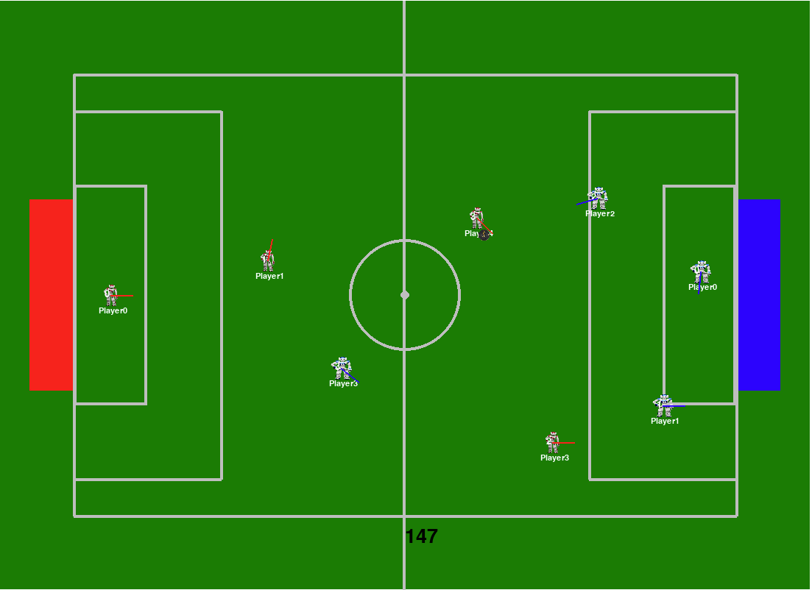

# NAO6 RoboCup Soccer Simulation

---

## Project Overview
This report delves into the simulation and strategic programming for the NAO6 humanoid robots in the RoboCup soccer competition. It outlines the team roles, decision-making algorithms, sensor integration, and communication protocols essential for effective robot soccer play.

---

## Introduction
This report outlines the strategic programming and blueprint of logics required for the NAO6 robots participating in a RoboCup football match. The game will involve two teams of four robots each, playing on a 9m x 6m field. The report provides an analysis of each role on the team—goalkeeper, defenders, and strikers—and the decision-making blueprints that guide the robots' behavior. The robot also uses marked strategic locations and field layout as parameters in deciding outputs.

The core logic is based on binary trees to represent decision-making in real-time, using yes and no functions to proceed. Robots use a combination of camera input, distance, and a shared communication system to execute strategies. The shared communication is particularly useful for coordinating passes and other collaborative actions.

### Key Aspects Explored in the Report:
1. **Field Layout and Key Zones of Play**: Understanding how robots position themselves within a 9m x 6m field.
2. **Role-Specific Behaviors**: Programming logic for goalkeepers, defenders, and strikers, focusing on decision trees that outline how robots handle various game situations.
3. **Sensor and Camera Integration**: NAO6 robots’ use of cameras and sensors for environmental awareness and interaction with the ball, opponents, and teammates.
4. **Real-Time Communication and Coordination**: The communication protocols enabling the robots to work as a cohesive team.
5. **Handling Special Scenarios**: Strategies for corner kicks, penalties, and free kicks.

---

## Field Layout and Positioning
The RoboCup field is compact, meaning efficient space management is critical. The field is divided into:

- **Defensive Half**: This is where defenders and the goalkeeper primarily operate.
- **Attacking Half**: The strikers focus on this area.
- **Goal Area**: The goalkeeper will be stationed here, making rapid decisions to defend the goal.

### Example of Playing Area:
- **Strategic Points**: Robots must move toward strategic points during play to ensure effective coverage. These points are programmed as positions to which a robot moves based on ball possession, game phase, and opponent location.

---

## Roles and Strategies

### Goalkeeper Strategy
**Primary Role**: The goalkeeper is responsible for defending the goal.

#### Key Responsibilities:
- **Ball Tracking**: Adjusting position continuously based on the ball’s position.
- **Interception**: Calculating the ball’s trajectory and deciding whether to intercept or block.
- **Communication with Defenders**: Sharing information about ball trajectory and positioning.
- **Clearing the Ball**: Deciding whether to pass to a teammate or clear the ball.

#### Decision Tree Example:
1. Is the ball in our half?
   - If yes, check the team’s possession.
   - If no, adjust position to the center of the goal.
2. Is an opponent approaching with the ball?
   - If yes, move toward the ball to intercept.
   - If no, stay on the spot and monitor the ball.
3. Is the interception successful?
   - If yes, quickly pass the ball to a teammate.
   - If not, try to intercept again.

### Defender Strategy
**Primary Role**: Marking opponents, intercepting passes, and clearing the ball.

#### Key Responsibilities:
- **Marking Opponents**: Positioning between the ball and the goal.
- **Ball Interception**: Moving to intercept when the ball enters the defensive half.
- **Passing and Clearing**: Deciding whether to pass the ball to a striker or clear it out.

#### Decision Tree Example:
1. Is the ball in our half?
   - If yes, move toward the ball and mark an opponent.
   - If no, stay in a defensive position.
2. Is our team holding the ball?
   - If yes, decide whether to pass.
   - If no, try to intercept the ball.
3. Is it suitable to pass?
   - If yes, pass forward.
   - If no, dribble to a safer position.

### Striker Strategy
**Primary Role**: Creating and executing scoring opportunities.

#### Key Responsibilities:
- **Positioning**: Moving to optimal positions in the attacking half.
- **Shooting**: Taking clear shots on goal.
- **Passing**: Passing the ball to better-positioned teammates when needed.
- **Dribbling**: Creating space for a shot or pass.

#### Decision Tree Example:
1. Is the ball in the attacking area?
   - If yes, determine ball possession.
2. Does the player hold the ball?
   - If yes, assess if it’s possible to shoot.
   - If no, move toward a strategic point.
3. Is it suitable to pass?
   - If yes, pass the ball.
   - If no, dribble and attempt to score.

---

## Communication Between Robots
Effective communication is vital for:
- Coordinating positions.
- Sharing information about ball trajectory.
- Avoiding overlapping roles.

---

## Gameplay Images
### Game Snapshots:



---

## Code Representation
### Red Players:
```python
red_players = [
    {'x': -428, 'y': 0, 'name': 'Player0', 'number': 0, 'radius': 18, 'ban_cycles': 0},
    {'x': -334, 'y': 216, 'name': 'Player1', 'number': 1, 'radius': 10, 'ban_cycles': 0},
    {'x': -250, 'y': -217, 'name': 'Player2', 'number': 2, 'radius': 10, 'ban_cycles': 0},
    {'x': -167, 'y': 216, 'name': 'Player3', 'number': 3, 'radius': 10, 'ban_cycles': 0},
    {'x': -83, 'y': -217, 'name': 'Player4', 'number': 4, 'radius': 10, 'ban_cycles': 0},
]
```
### Blue Players:
```python
blue_players = [
    {'x': 428, 'y': 0, 'name': 'Player0', 'number': 0, 'radius': 18, 'ban_cycles': 0},
    {'x': 334, 'y': -216, 'name': 'Player1', 'number': 1, 'radius': 10, 'ban_cycles': 0},
    {'x': 250, 'y': 217, 'name': 'Player2', 'number': 2, 'radius': 10, 'ban_cycles': 0},
    {'x': 167, 'y': -216, 'name': 'Player3', 'number': 3, 'radius': 10, 'ban_cycles': 0},
    {'x': 83, 'y': 217, 'name': 'Player4', 'number': 4, 'radius': 10, 'ban_cycles': 0},
]
```
### Ball:
```python
ball = {
    'x': 0, 'y': 0, 'radius': 8, 'owner_color': None, 'owner_number': None, 'speed': 0, 'direction': None
}
```
---
